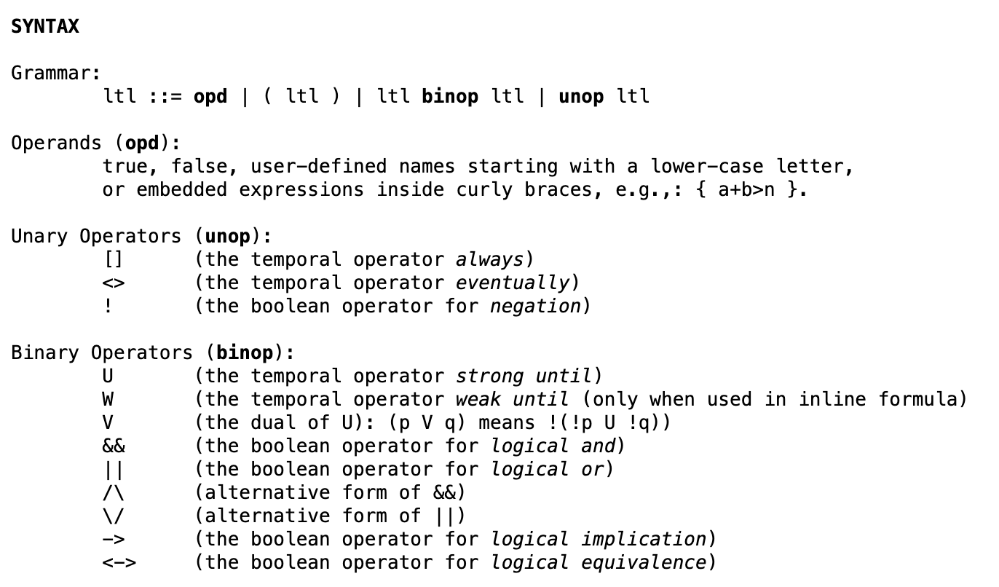

# Introduction

Model checking formulas of temporal logic against a model has a wide range of applications in hardware and software verification. Here we will look at one example: How to use Spin to verify the design of distributed protocols. 

On the syntax side, we will work with Linear Temporal Logic, that is, a modal logic in which $\Box$ means "always now and in the future" and $\Diamond$ means "sometimes, now or in the future". There are also variations of "until".

On the semantic side, formulas will be interpreted in the initial state (or world) of infinite runs (or execution sequences) of a "model". A model here is a transition system with an initial state, a successor relation, and valuations of atomic propositions for each state. Thus a model coincides with a Kripke model as discussed in the chapter on modal logic, but the semantics is different since formulas are not evaluated directly in the model but in the infinite runs defined by the model.

## Definitions

First, we should look at [the definition of the syntax of LTL in Spin](https://spinroot.com/spin/Man/ltl.html).

The correspondence between the Ascii and the math notation is as follows. `[]` is $\Box$, `<>` is $\Diamond$, `!` is $\neg$, `&&` and `/\` are $\wedge$, `||` and `\/` are $\vee$.

**Exercise/Activity**: Write some formulas and translate them into informal English.

The semantics is as follows. Let $M$ be a finite state machine with an initial state. For now, we will assume that we know how this finite state machine generates a set of infintie runs $(v_n)\_{n\in\mathbb{N}}$. The full [semantics definition of Promela programs](https://spinroot.com/spin/Man/Intro.html) is available in the manual, but will only start making sense after having seen enough examples of Promela programs. So, for now, we will skip how exactly one obtains the execution sequences $(v_n)\_{n\in\mathbb{N}}$ from the Promela program $M$. Let us just think of $M$ as a [transition system](https://en.wikipedia.org/wiki/Transition_system) or [finite state machine](https://en.wikipedia.org/wiki/Finite-state_machine). Then every run $(v_n)\_{n\in\mathbb{N}}$ is simply a possible execution sequence of the program (or model or finite state machine or transition system) $M$.

**Semantics of LTL.** Let $v=(v_n)\_{n\in\mathbb{N}}$ be a sequence[^1] of valuations $v_n:\mathbb{P}\to\{0,1\}$.

- $v_n\models p$ if $v_n(p)=1$,
- $v_n\models \neg \phi$ if not $v_n\models\phi$,
- $v_n\models \phi\wedge\psi$ if $v_n\models\phi$ and $v_n\models\psi$,
- $v_n\models{\Large{\circ}}\phi$ if $v_{n+1}\models\phi$,
- $v_n\models\Box\phi$ if $v_m\models\phi$ for all $m\ge n$,
- $v_n\models\Diamond\phi$ if $v_m\models\phi$ for some $m\ge n$

$M\models\phi$ if $v_0\models\phi$ for all execution sequences $v_n$ of $M$. 

$M\models\Phi$ if $M\models\phi$ for all $\phi\in\Phi$.

$\Phi\models\phi$ if $M\models\Phi$ implies $M\models\phi$ for all models $M$. 

$\models\phi$ (read as '$\phi$ is valid') if $M\models\phi$ for all models $M$.

[^1]: $\mathbb{N}=\{0,1,2\ldots\}$ denotes the set of natural numbers; $(v_n)\_{n\in\mathbb{N}}$, or $(v_n)$, is short for $(v_0,v_1,v_2\ldots)$. Each $v_n$ represents a state of the computation. Think of it as the memory and of $v_n(p)$ as the value of bit $p$ at time $n$.

